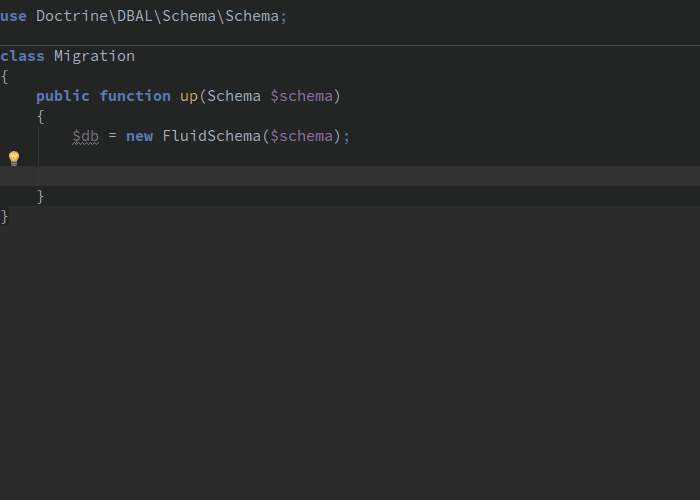

[](https://packagist.org/packages/thecodingmachine/dbal-fluid-schema-builder)
[](https://packagist.org/packages/thecodingmachine/dbal-fluid-schema-builder)
[](https://packagist.org/packages/thecodingmachine/dbal-fluid-schema-builder)
[](https://packagist.org/packages/thecodingmachine/dbal-fluid-schema-builder)
[](https://scrutinizer-ci.com/g/thecodingmachine/dbal-fluid-schema-builder/?branch=master)
[](https://travis-ci.org/thecodingmachine/dbal-fluid-schema-builder)
[](https://coveralls.io/github/thecodingmachine/dbal-fluid-schema-builder?branch=master)

# Fluid schema builder for Doctrine DBAL

Build and modify your database schema using [DBAL](http://docs.doctrine-project.org/projects/doctrine-dbal/en/latest/reference/schema-representation.html) and a fluid syntax.



## Why?

Doctrine DBAL provides a powerful API to alter your database schema.
This library is a wrapper around the DBAL standard API to provide a shorter, quicker syntax for day-to-day use. It provides shortcuts and syntactic sugars to make you efficient.

### IDE friendly

You can use the autocomplete of your preferred IDE (PHPStorm, Eclipse PDT, Netbeans...) to build your schema easily. No need to look at the docs anymore!

### Static code analysis

Your favorite static PHP code analyzer (Scrutinizer, PHPStan...) can catch errors for you!
For instance, each database type is a PHP method, so no typos anymore in the column type - ... was it 'INT' or 'INTEGER' already? :)

## Why not?

The fluid schema builders aims at solving the cases you encounter in 99% of your schemas in a concise way.
It does not cover the whole possible use cases and there is no aim to target that goal.

For instance, if you have foreign keys on several columns, you cannot use `FluidSchema`. You should fallback to classic DBAL.


## Comparison with DBAL "native" API

Instead of:

```php
$table = $schema->createTable('posts');
$table->addColumn('id', 'integer');
$table->addColumn('description', 'string', [
    'length' => 50,
    'notnull' => false,
]);
$table->addColumn('user_id', 'integer');
$table->setPrimaryKey(['id']);
$table->addForeignKeyConstraint('users', ['user_id'], ['id']);
```

you write:

```php
$db = new FluidSchema($schema);

$posts = $db->table('posts');

$posts->id() // Let's create a default autoincremented ID column
      ->column('description')->string(50)->null() // Let's create a 'description' column
      ->column('user_id')->references('users');   // Let's create a foreign key.
                                                  // We only specify the table name.
                                                  // FluidSchema infers the column type and the "remote" column.
```

## Features

FluidSchema does its best to make your life easier.

**Tables and column types**

```php
$table = $db->table('foo');

// Supported types
$table->column('xxxx')->string(50)              // VARCHAR(50)
      ->column('xxxx')->integer()
      ->column('xxxx')->float()
      ->column('xxxx')->text()                  // Long string
      ->column('xxxx')->boolean()
      ->column('xxxx')->smallInt()
      ->column('xxxx')->bigInt()
      ->column('xxxx')->decimal(10, 2)          // DECIMAL(10, 2)
      ->column('xxxx')->guid()
      ->column('xxxx')->binary(255)
      ->column('xxxx')->blob()                  // Long binary
      ->column('xxxx')->date()
      ->column('xxxx')->datetime()
      ->column('xxxx')->datetimeTz()
      ->column('xxxx')->time()
      ->column('xxxx')->dateImmutable()         // From Doctrine DBAL 2.6+
      ->column('xxxx')->datetimeImmutable()     // From Doctrine DBAL 2.6+
      ->column('xxxx')->datetimeTzImmutable()   // From Doctrine DBAL 2.6+
      ->column('xxxx')->timeImmutable()         // From Doctrine DBAL 2.6+
      ->column('xxxx')->dateInterval()          // From Doctrine DBAL 2.6+
      ->column('xxxx')->array()
      ->column('xxxx')->simpleArray()
      ->column('xxxx')->json()                  // From Doctrine DBAL 2.6+
      ->column('xxxx')->jsonArray()             // Deprecated in Doctrine DBAL 2.6+
      ->column('xxxx')->object();               // Serialized PHP object
```

**Shortcut methods:**

```php
// Create an 'id' primary key that is an autoincremented integer
$table->id();

// Don't like autincrements? No problem!
// Create an 'uuid' primary key that is of the DBAL 'guid' type 
$table->uuid();

// Create "created_at" and "updated_at" columns
$table->timestamps();
```

**Creating indexes:**

```php
// Directly on a column:
$table->column('login')->string(50)->index();

// Or on the table object (if there are several columns to add to an index):
$table->index(['category1', 'category2']);
```

**Creating unique indexes:**

```php
// Directly on a column:
$table->column('login')->string(50)->unique();

// Or on the table object (if there are several columns to add to the constraint):
$table->unique(['login', 'status']);
```

**Make a column nullable:**

```php
$table->column('description')->string(50)->null();
```

**Set the default value of a column:**

```php
$table->column('enabled')->bool()->default(true);
```

**Create a foreign key**

```php
$table->column('country_id')->references('countries');
```

**Note:** The foreign key will be automatically created on the primary table of the table "countries".
The type of the "country_id" column will be exactly the same as the type of the primary key of the "countries" table.

**Create a jointure table (aka associative table) between 2 tables:**

```php
$db->jointureTable('users', 'roles');

// This will create a 'users_roles' table with 2 foreign keys:
//  - 'user_id' pointing on the PK of 'users'
//  - 'role_id' pointing on the PK of 'roles'
```

**Add a comment to a column:**

```php
$table->column('description')->string(50)->comment('Lorem ipsum');
```

**Declare a primary key:**

```php
$table->column('uuid')->string(36)->primaryKey();

// or

$table->column('uuid')->then()
      ->primaryKey(['uuid']);
```
